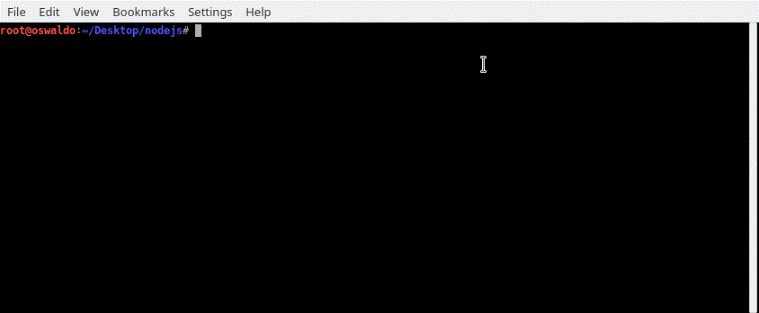

# Título del Proyecto

_La intencion de este proyecto es utilizar la libreria selenium,el programa hace una busqueda de video  y devuelve la url._

### Pre-requisitos 📋

_Que cosas necesitas para instalar el software y como instalarlas_

```
"dependencies": {
    "node":">= v10.16.0"
    "color": "^3.1.2",
    "colors": "^1.3.3",
    "commander": "^3.0.1",
    "selenium-webdriver": "^4.0.0-alpha.4"
  }

  "Necesitas Descargar node he instalarlo" : https://nodejs.org/
  
  "Instalar las dependencias " : npm i package.json 


```

### Entorno de Ejecucion 🔧


_mostrar ayuda _

```
node youtbesearch.js --help  

```

_Ejecutar el archivo para buscar los videos_

```
node youtbesearch.js -f filename.txt

```
### GIF 
```
GIF 
```




